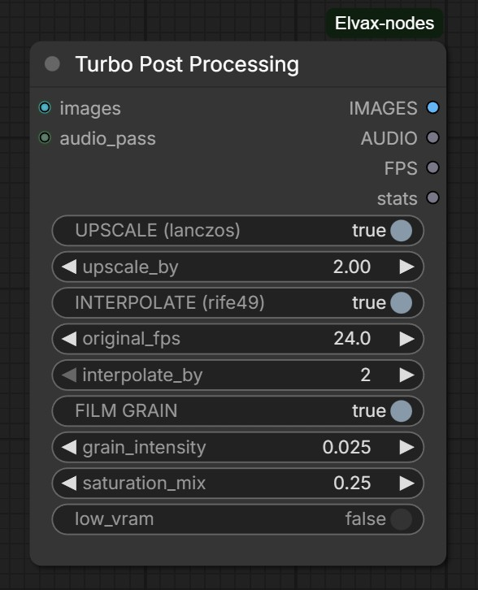
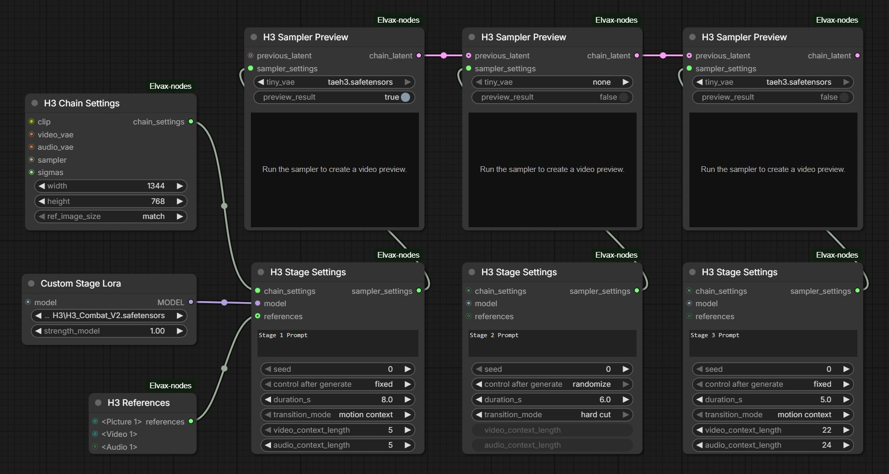
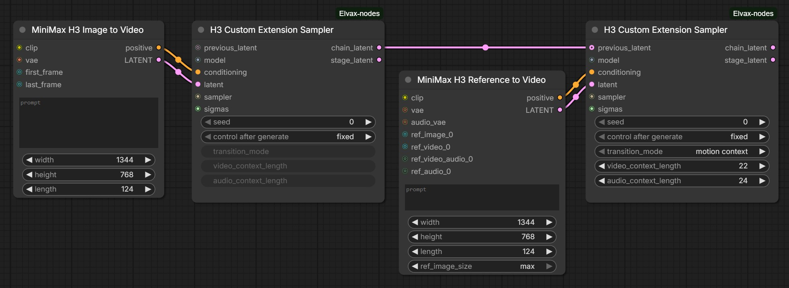

# Elvax Nodes

Convenience nodes for ComfyUI!

- LLM TURBO: Run local LLMs faster, directly in ComfyUI
- Load and crop images faster in one node
- Upscale, interpolate, and add film grain in one node
- Tidy workflows with Dynamic Pipes, supporting Set/Get nodes and reroutes

And more...

## LLM Turbo


Run local GGUF models directly inside ComfyUI at blazing speed through the 
llama.cpp backend, with no external LLM app, setup, or headache! Pair system and
user prompts with dynamically growing image or audio inputs, including image batches, 
and use MTP where supported. The `stats` output reports total node
runtime and llama.cpp generation speeds. Select models from `models/LLM` or
`models/text_encoders`; image and audio inputs require a compatible model and
projector (`mmproj`).


## Load/Crop Image

Load and crop an image quickly in one node. Refine the crop interactively, send
the current image and its matching mask downstream, or restore the original.


## Dynamic Pipe In / Dynamic Pipe Out

Bundle connected values in input order and carry them through a single pipe.
Dynamic Pipe In grows as you connect values; Dynamic Pipe Out unpacks them into
separate outputs in their original order, keeping complex workflows
tidy without changing the values themselves. Supports Set/Get nodes and
Reroutes!


## Prompt Edit / Preview

**Preview** and **edit** text in one node. Edit the preview text with one
click, then refine it before passing it downstream.


## Turbo Post Processing

Upscale with Lanczos, interpolate with RIFE 4.9, and add film grain in one
fast node, with optional low-VRAM processing.



## Queue Reference Map

Keep track of queued generations with their first reference image and prompt.
See the current queue order and cancel an individual item directly from the node.

## H3 Staged Samplers

Build a MiniMax H3 generation as a configurable stage-by-stage chain. Set shared
generation parameters once in `H3 Chain Settings`, then tailor each stage with
`H3 Stage Settings`. Use `H3 Sampler Preview` to sample the stage, optionally
show a live tiny-VAE preview or decode the full video, and pass the accumulated
latent into the next stage. Motion Context continues from prior latent context;
Hard Cut starts a fresh joined segment.

`H3 Chain Settings`: Configure the shared settings for a MiniMax H3 extension
chain.

`H3 Stage Settings`: Configure each stage of a MiniMax H3 extension chain
independently (supports custom Loras for each stage)

`H3 Sampler Preview`: Sample a stage, optionally show a live tiny-VAE preview
during sampling or decode a full video preview, and pass the accumulated latent
to the next stage. The `preview_result` toggle controls full video decoding;
live previews are available when a tiny VAE is selected.

`H3 References`: Bundle picture, video, and audio references with MiniMax H3
token labels for use in H3 Stage Settings. Audio slots 1–3 pair with their
matching connected video slots; remaining audio slots are standalone.



## H3 Custom Extension Sampler

Seamlessly extend a MiniMax H3 generation from one sampler stage to the next,
with controls to customize exactly how you want it built. Sampling stays
lightweight: the node returns the accumulated `chain_latent` and this stage's
`stage_latent` without decoding, so you can connect your preferred preview or
decode workflow.



## Installation

### ComfyUI Manager

Open **Manager → Custom Nodes Manager**, search for **Elvax Nodes**, and select
**Install**. Restart ComfyUI.

### Manual installation

Clone this repository into `ComfyUI/custom_nodes`:

```bash
git clone https://github.com/younestft/Elvax-nodes.git
```

Install the Python dependency with the Python environment used by ComfyUI:

```bash
python -m pip install -r ComfyUI/custom_nodes/Elvax-nodes/requirements.txt
```

Restart ComfyUI. The nodes appear under the `Elvax` category.


## License and credits

This repository is licensed under GNU GPL v3 or later; see [LICENSE](LICENSE).

Many nodes in this pack are based on or inspired by ComfyUI's native nodes.
Credit to the Comfy Org team for ComfyUI and its native node implementations.
The H3 tiny-VAE preview is credited to Kijai and KJNodes.

LLM Turbo is adapted from the GPL-3.0-licensed
[ComfyUI-LLM-text-processor](https://github.com/KingManiya/ComfyUI-LLM-text-processor)
by KingManiya.

The H3 Extension Sampler is a modified derivative of
[ComfyUI-H3-Motion-Context](https://github.com/NikoDemon80/ComfyUI-H3-Motion-Context)
by NikoDemon80.

The bundled H3 References node is adapted from the GPL-3.0-licensed
[ComfyUI-H3-Prompt-IDE](https://github.com/ethanfel/ComfyUI-H3-Prompt-IDE) by
Ethan Fel.

Turbo Post Processing brings together ComfyUI's native Lanczos image scaling,
RIFE 4.9 interpolation from [Fill-Nodes](https://github.com/filliptm/ComfyUI_Fill-Nodes)
by filliptm, and Fast Film Grain from
[VRGameDevGirl's nodes](https://github.com/vrgamegirl19/comfyui-vrgamedevgirl).
