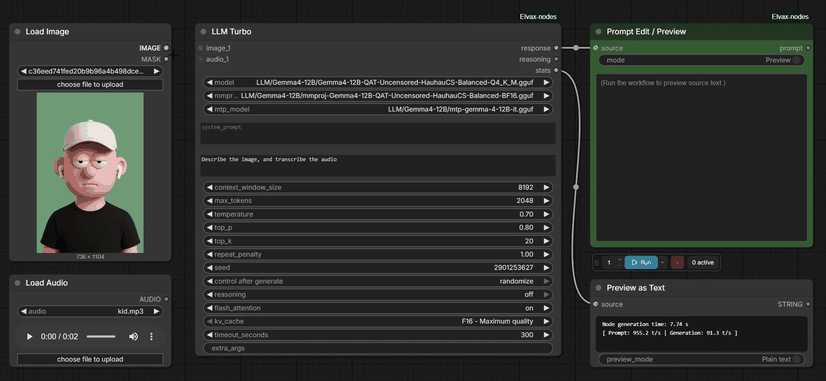
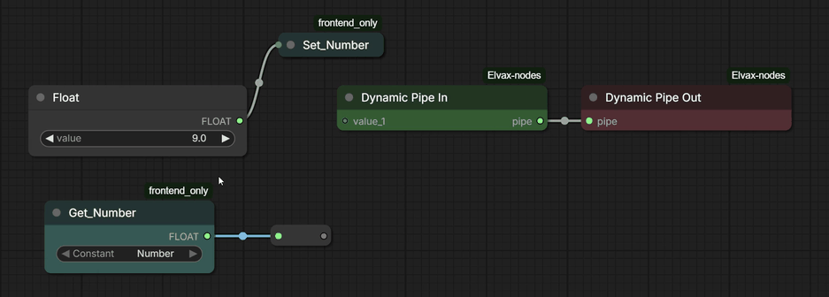
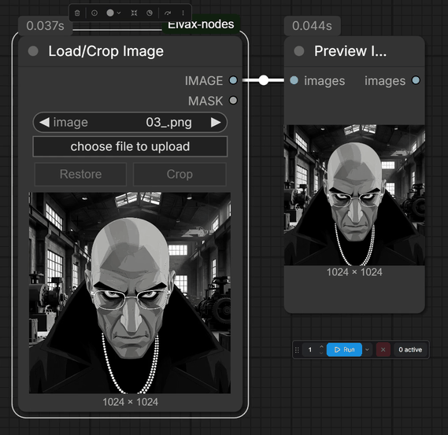

# Elvax Nodes

Convenience nodes for ComfyUI.

## LLM Turbo

Runs local GGUF language and vision models through llama.cpp. Select a model from
ComfyUI's configured `LLM` or `text_encoders` folders. For image batches, connect
`images` and select a matching `mmproj`. Enter separate `system_prompt` and
`user_prompt` text; `context_window_size` sits directly below the user prompt.
The `stats` output includes total node execution time and llama.cpp speed figures
when available. GPU and CPU layer placement use llama.cpp defaults. On supported
Windows CUDA systems, the node can download its pinned llama.cpp release if a
matching local binary is not already available.




## Dynamic Pipe In / Dynamic Pipe Out

Organize multiple connections as one cable. Dynamic Pipe In begins with one
input and adds the next empty input when a value is connected. Dynamic Pipe Out
then creates matching named outputs when the pipe is connected. The nodes carry
data only; they do not alter the values or improve inference performance.



## Load/Crop Image

Loads an image with the familiar ComfyUI upload control and adds an interactive
crop box. Apply the crop to use it as the node's `IMAGE` output, crop again as
needed, or restore the original image. The node also outputs the matching mask.



## H3 Staged Samplers

`H3 Chain Settings` holds the shared CLIP, VAEs, sampler, sigmas, dimensions,
and reference sizing. Connect it to each `H3 Stage Settings` node; configure
each stage's model, references, prompt, seed, duration, and transition there.
Connect each stage's settings to `H3 Sampler Preview`, then chain its
`chain_latent` output into the next preview node's `previous_latent` input.
`motion context` carries prior latent context; `hard cut` joins without it and
trims the new stage's first five video frames.

`H3 Sampler Preview` can show live previews with a selected tiny VAE and create
a final video preview. The `preview_result` toggle controls only the final
video; live previews remain enabled whenever `tiny_vae` is selected.

The bundled `H3 References` node uses the same `H3_PROMPT_REFERENCES`
wire type and payload as the H3 Prompt IDE reference node. It works with the
new samplers without the Prompt IDE pack. When the Prompt IDE is installed, its
reference palette and previews recognize the Elvax node ID through a small
frontend alias in the local Prompt IDE installation.

Audio slots 1-3 pair with the matching video slot when that video is connected;
otherwise they act as standalone audio. Slots 4-6 are standalone audio.

## H3 Custom Extension Sampler

A single-node MiniMax H3 generation lane. Each instance keeps its own LoRA-fed
model, sampler, sigmas, and seed. It does not decode internally and has no VAE
inputs. Its `transition_mode` dropdown offers:

- `motion context`: carries the preceding video and audio latents as
  continuation context and trims their repeated head.
- `hard cut`: samples without preceding-stage conditioning and joins with no
  conditioning overlap. To keep the accumulated H3 latent decodable as one
  stream, it trims the new stage's first 5 video frames at each join.

Hover over `transition_mode` for its explanation. `chain_latent` is the
accumulated sequence for the next stage; `stage_latent` is this stage alone,
with its transition overlap removed. Decode either output downstream when
needed.

## Installation

Clone this repository into `ComfyUI/custom_nodes`:

```bash
git clone https://github.com/younestft/Elvax-nodes.git
```

Install the Python dependency with the Python environment used by ComfyUI:

```bash
python -m pip install -r ComfyUI/custom_nodes/Elvax-nodes/requirements.txt
```

Restart ComfyUI. The nodes appear under the `Elvax` category.


## License and credits

This repository is licensed under GNU GPL v3 or later; see [LICENSE](LICENSE).

The H3 Extension Sampler is a modified derivative of
[ComfyUI-H3-Motion-Context](https://github.com/NikoDemon80/ComfyUI-H3-Motion-Context)
by NikoDemon80. It retains GPL-licensed H3 layout checks, latent-tail slicing,
and timeline-aligned audio-continuation logic.

The bundled H3 References node is adapted from the GPL-3.0-licensed
[ComfyUI-H3-Prompt-IDE](https://github.com/ethanfel/ComfyUI-H3-Prompt-IDE) by
Ethan Fel. It preserves the input socket labels and reference bundle contract.

LLM Turbo is adapted from the GPL-3.0-licensed
[ComfyUI-LLM-text-processor](https://github.com/KingManiya/ComfyUI-LLM-text-processor)
by KingManiya. It retains the GGUF llama.cpp invocation, image conversion, and
response parsing, with Elvax-specific inputs, model discovery, and timing output.
